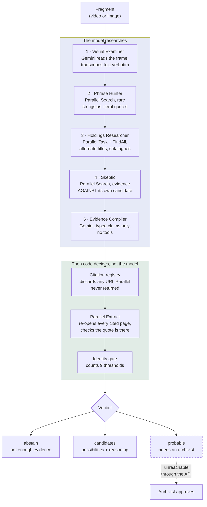

# Last Seen Alive

**Film archives hold reels nobody can name. This investigates what one might be, and refuses to name it when the evidence will not carry it.**

| | |
|---|---|
| **Live product** | https://last-seen-alive-109051079423.us-central1.run.app |
| **Track** | Parallel |
| **Judge access** | `POST /v1/keys` with `{"tier":"judge"}`. No email, no signup. |
| **Run locally** | `uvicorn app.api.main:app --reload` |

---

## Start here

Three pages, in this order. They take about four minutes.

| | Page | What you will see |
|---|---|---|
| 1 | [`/presets`](https://last-seen-alive-109051079423.us-central1.run.app/presets) | Ten real Library of Congress fragments. **Five should be identified, five should not.** Watch or download any of them. |
| 2 | [`/dossiers`](https://last-seen-alive-109051079423.us-central1.run.app/dossiers) | A finished investigation, without waiting five minutes for one. Every claim, its source, and **the citations that were thrown out**. |
| 3 | [`/evaluation`](https://last-seen-alive-109051079423.us-central1.run.app/evaluation) | **All 28 recorded runs, including the nine where it named the wrong film.** |

Everything else: [`/practice`](https://last-seen-alive-109051079423.us-central1.run.app/practice) (published practitioner demands, answered or admitted) · [`/stack`](https://last-seen-alive-109051079423.us-central1.run.app/stack) (every sponsor surface with the line of code that calls it) · [`/api`](https://last-seen-alive-109051079423.us-central1.run.app/api) (mint a key and call it from the browser).

---

## The problem

Only **14% of American silent feature films survive in their original format**, about 1,575 of roughly 11,000 ([Pierce, CLIR / Library of Congress, 2013](https://www.clir.org/2013/12/clir-and-lc-publish-report-on-americas-endangered-silent-film-heritage/)). Of what survives, much arrives unlabelled.

The Library of Congress runs a workshop for exactly this, and publishes its hit rate: **23%, 29% and 30%** of the films screened in 2016, 2017 and 2018 ([Mostly Lost](https://www.loc.gov/item/prn-19-057/librarys-cinematic-quest-for-mostly-lost-films/2019-05-23/)). Identification is expert-scarce and happens four days a year.

The dangerous failure here is not a wrong answer. It is a **plausible** one: a catalogue entry that looks researched, propagates for thirty years, and quietly misattributes a film. So this system is built to show its evidence rather than to sound confident.

---

## How it works



**The model gathers evidence. It never decides what the evidence is worth.** `probable` requires human approval, which is one of the nine thresholds and which no API call can satisfy. The strongest thing the API can return is `candidates`.

---

## What you get back

A dossier, not an answer:

- **Every claim with its source** and the exact quoted excerpt
- **Contradictions against the leading candidate**, shown beside the evidence for it
- **Which citations were refused**, and why
- **Nine thresholds**, each shown whether it passed or failed
- **A standing watch** when a fragment stays unidentified, because archives digitise continuously

You can send your own footage (`POST /v1/investigate`, or the "Bring your own" tab), or run one of the ten public demo fragments (`POST /v1/identify`).

---

## What the evaluation says

We ran the same five development fragments **28 times** and published every run.

| Across 28 runs | |
|---|---:|
| Cases giving the same verdict every time | **1 of 5** |
| Correct identities | 3 |
| **Named the wrong film** | **9** |
| Candidates that were not a film at all | 7 |
| **Ever claimed a probable identity** | **0** |

Our first measured pass recorded two correct identities and zero false-confident identifications. **Repeating it disagreed.** One case returned four different leading candidates in four runs; another returned the same wrong film three times out of four.

That is published rather than smoothed over, at [`/v1/eval/stability`](https://last-seen-alive-109051079423.us-central1.run.app/v1/eval/stability), because a system that asks an archivist to trust it cannot hide the runs where it was wrong.

The property that held across all 28 runs: **it never once claimed a probable identity.** Every wrong answer arrived as `candidates` with its failing thresholds attached. That is a weaker claim than "never wrong", and it is the true one.

Full method: [`docs/ABLATION.md`](docs/ABLATION.md) · before and after the fixes: [`/v1/eval/fix-comparison`](https://last-seen-alive-109051079423.us-central1.run.app/v1/eval/fix-comparison)

---

## Research this is built on

| Source | What we took from it |
|---|---|
| [Pierce, *The Survival of American Silent Feature Films: 1912–1929*](https://www.clir.org/2013/12/clir-and-lc-publish-report-on-americas-endangered-silent-film-heritage/) (CLIR / LOC, 2013) | The size of the problem, and that survivors are scattered across countries and formats |
| [Mostly Lost, Library of Congress](https://www.loc.gov/item/prn-19-057/librarys-cinematic-quest-for-mostly-lost-films/2019-05-23/) | The professional method (read the frame, search databases) and how hard it is: 23–30% per workshop |
| [FIAF Moving Image Cataloguing Manual (2016)](https://www.fiafnet.org/pages/E-Resources/Cataloguing-Manual.html) | Seven page-cited requirements, published at [`/v1/standards`](https://last-seen-alive-109051079423.us-central1.run.app/v1/standards). One was failing and is now fixed |
| [Abele et al., *ArchiveGPT*, arXiv:2507.07551](https://arxiv.org/abs/2507.07551) | Archive experts evaluating AI cataloguing: hallucination, the need for human review, and that trust depends on a transparent pipeline |
| [Heuer, *Analysis of Competing Hypotheses*](https://onlinelibrary.wiley.com/doi/full/10.1002/acp.3550) (evaluated in Dhami et al., 2019) | Two gate thresholds: a hypothesis nothing opposes has not been tested, and only evidence that discriminates counts |
| [Jhaveri et al., *Failing to Falsify*, arXiv:2604.02485](https://arxiv.org/abs/2604.02485) | Confirmation bias in LLM exploration is about which evidence gets *selected*, which is what our failing runs looked like |

No archivist has reviewed this system. Rather than leave that as a caveat, [`/practice`](https://last-seen-alive-109051079423.us-central1.run.app/practice) publishes 14 demands taken verbatim from these sources and answers each one. **Four are marked unanswered, starting with the missing review itself.**

---

## The stack

Every surface below is imported and called on the request path. [`/stack`](https://last-seen-alive-109051079423.us-central1.run.app/stack) shows each one with its call site and whether it is reachable right now.

**Google Cloud** — Agent Development Kit (`google-adk`), Gemini 2.5 Flash on Vertex AI (`google-genai`), Vertex AI controlled generation, Cloud Run, Secret Manager.

**Parallel** — all six surfaces, each with a distinct job:

| Surface | Job |
|---|---|
| Search | Rare visible phrases, as literal quoted strings |
| Task | Alternate titles and holdings, against an archival source policy |
| FindAll | A census of named catalogues (asynchronous; returns a handle) |
| Extract | Re-opens every cited page to confirm the quotation is really there |
| Task Group | One independent run per candidate, whose only job is to disprove it |
| Monitor | Keeps an unidentified fragment under a standing weekly watch |

---

## Run it yourself

```bash
git clone https://github.com/usv240/last-seen-alive
cd last-seen-alive
pip install -r requirements.resolved.txt

uvicorn app.api.main:app --reload      # http://127.0.0.1:8000
```

The site, the worked example dossier and the published evaluation all work with no credentials. A live investigation needs `GOOGLE_CLOUD_PROJECT` and `PARALLEL_API_KEY`; see [`.env.example`](.env.example). Without them the workflow **refuses rather than guessing**, which is the intended behaviour.

### Tests

```bash
pip install pytest==9.1.1 pytest-asyncio==1.3.0 ruff==0.15.6
pytest -q                      # 252 tests, offline, no credentials needed
ruff check .
```

Two suites need the internet, and neither needs a credential:

```bash
python scripts/verify_live.py  # 98 checks against the deployed service
python scripts/walk_demo.py    # drives a real browser through every page
```

`verify_live.py` checks behaviour rather than status codes: that the bytes served for a demo fragment hash to the value the manifest publishes, that a held-out case is refused on every path, that a key minted once authenticates across the instance pool.

### Reproduce the evaluation

```bash
python scripts/run_ablation.py --write     # control arm: Gemini alone, no web, no gate
python scripts/run_stability.py --passes 2 # repeat the development split
python scripts/score_stability.py --write  # score every run against the sealed key
python scripts/compare_fix.py --write      # before and after the two fixes
```

---

## What this is not

- **Not an attribution authority.** It is triage. An archivist approves or rejects every identification.
- **Not reviewed by an archivist.** See [`/practice`](https://last-seen-alive-109051079423.us-central1.run.app/practice), entry P5.
- **Not stable across runs.** See the table above, and [`docs/LIMITATIONS.md`](docs/LIMITATIONS.md).
- **Not measured on the held-out split.** Five fragments have never been run; their hashes are published at [`/v1/eval/manifest`](https://last-seen-alive-109051079423.us-central1.run.app/v1/eval/manifest) so the set cannot be quietly changed.

---

## Documentation

| | |
|---|---|
| [`JUDGING.md`](JUDGING.md) | What to check, and in what order |
| [`docs/ARCHITECTURE.md`](docs/ARCHITECTURE.md) | How the pieces fit together |
| [`docs/ABLATION.md`](docs/ABLATION.md) | Three arms, the stability study, and the fix that only half worked |
| [`docs/IMPACT.md`](docs/IMPACT.md) | The case for it, from cited sources |
| [`docs/LIMITATIONS.md`](docs/LIMITATIONS.md) | Everything it cannot do |
| [`docs/STANDARDS-CONFORMANCE.md`](docs/STANDARDS-CONFORMANCE.md) | FIAF and EN 15907, page-cited |
| [`docs/DESIGN.md`](docs/DESIGN.md) | Interface principles and the reasons for them |
| [`docs/PRIOR-ART.md`](docs/PRIOR-ART.md) | What already exists, and why this is not that |
| [`submission-evidence.json`](submission-evidence.json) | Every claim above, machine-readable |

---

## Licence and credits

Apache License 2.0. Evaluation fragments are public domain, courtesy of the **Library of Congress National Screening Room**; see [`ASSET_RIGHTS.md`](ASSET_RIGHTS.md).
